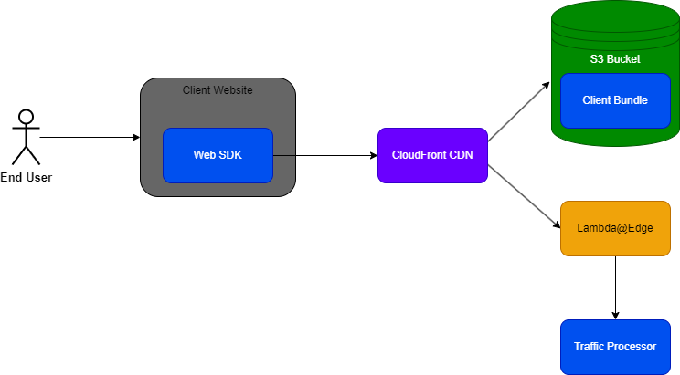

# kasada-challenge

## High-Level Requirements

* Enable the loading of the sensors on customer's website via the Client Bundle in an efficient, secure way
* Provide efficient communication with the back-end traffic processor to provide the sensor data and perform the interrogation
* Allow for reliable deployments and fast prototyping of the client sensors
* Ensure the validity and integrity of the sensor data is maintained, even in the presence of a malicious attacker

## Design

<figure>
  
  <figcaption>One potential system to service the Interrogation Process</figcaption>
</figure>

### Sensor Environment

Firstly we need to decide on how the Web SDK and Client Bundle are accessed.  As they will be retrieving details of the end-user's runtime environment they will need to be executed within the browser as well.  If the Web SDK's sole responsibility is loading the Client Bundle then the best option would be to distribute it to the customers and allow them to package it directly within their application; otherwise, if it has other tasks, then it should be kept separate and sourced by the client website at load time.

These steps should not add significant time to the page load or else risk introducing a poor experience to the customer's legitimate users.  A CDN is a good solution as it will automatically enhance efficiency through distributed hosting and caching. In AWS this would be CloudFront, with an S3 bucket as the Origin which stores the script files. Even if the Web SDK is distributed directly to customers this would be an ideal solution for storing and accessing the Client Bundle.

### Back-end Processing

Continuing with efficiency, the back-end interrogation step could also be served via CloudFront as a "Lambda@Edge".  Alternatively, if this is still too slow, we could consider an asynchronous pattern: send the sensor data to the back-end and return immediately while still processing in the background.  Polling or Server Side Events can then be used to check the results of the interrogation (with an appropriate timeout in place).  Choosing between these two options is an engineering decision, where the latter offers a potentially better end-user experience at the cost of allowing attackers to progress further through the page load than they otherwise would have.  Given this I would start with the former as the more secure option, but also use asynchronous processing for any non-critical flows such as logging, reporting, etc.

### Deployment and Rollout

With the above approach, deployment of new sensors via the Client Bundle is mostly a matter of updating the deployment files in the S3 bucket, which can be done quite easily.  The Web SDK could be configured to return the "latest" deployment using version numbers in the filename, which would allow for easy blue/green deployments, feature flags, and rollbacks just by modifying these names.

Note that whilst this will make deployments quick and seamless, the effects won't be noticed immediately due to CloudFront caching the old version: this can be rectified by adding a step to the deployment pipeline to forcibly flush the cache via the CloudFront API.  CloudFront can also support prototyping through staged releases, such as A/B testing, with the use of another edge lambda.  In this way any changes to the Client Bundle can be released gradually to a small subset of end users and quickly rolled back if the number of false positives becomes unacceptable.

### Sensor Data Integrity

Preventing the sensor data from being tampered with is a difficult problem.  As it's running client-side there are a number of ways that a malicious attacker could manipulate the values: I don't have a complete answer on how to solve for all of these use-cases, but I'll go through some suggestions on how to start addressing them.

Firstly, once the Client Bundle is sourced it should complete all its work (retrieving the sensor data and transmitting it to the Traffic Processor) immediately.  No intermediate values should be stored, as attackers will likely have access to local/session storage and cookies.  The data should be transmitted via HTTPS, which uses PKE and will stop traditional MITM attacks.

Another approach that some authentication providers use is to run their scripts as a hidden iframe, keeping the behaviour isolated from the main application, then sending the results via postMessage.  I expect this won't be suitable here though, as having the sensors run within the iframe context will likely invalidate their results.

These approaches are common for more traditional client-side security, where the expectation is that the regular end-user is benign and the attacker is attempting to target them or their session.  In this case, however, the end-user is likely the attacker, so we need to re-frame the problem.  In particular, they could be running their own browser which deliberately bypasses client-side security mechanisms like iframe isolation and HTTP-only cookies.

With a manipulated browser there's nothing stopping the attacker from directly editing the sensor data response message, or blocking it entirely.  In this situation the only real solution is to strengthen the Traffic Processor to be able to identify this manipulation.  Faking data to look legitimate is not as easy as it sounds, and significant work has been done on classification models for this and similar problems like network intrusion and financial statement fraud.  I think that this approach would be the best option to improve confidence in the authenticity and integrity of the sensor data.
